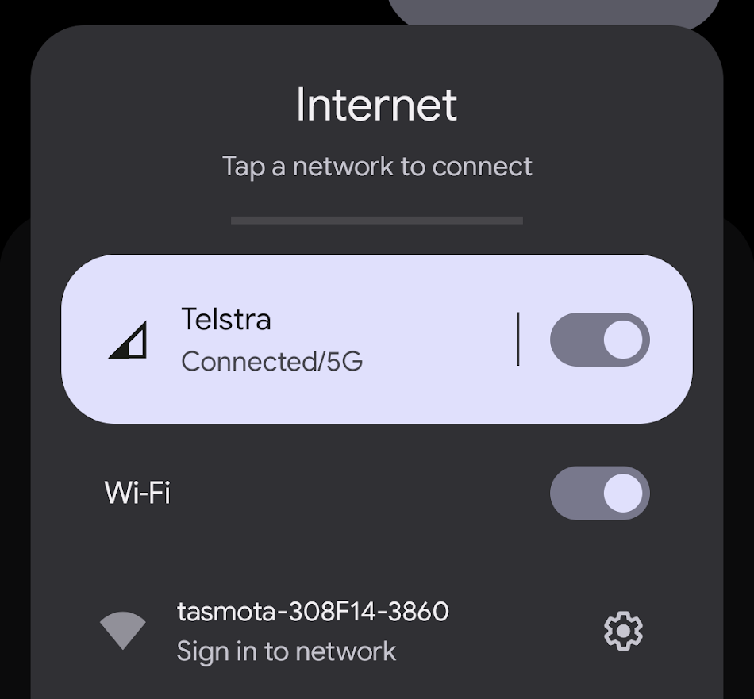
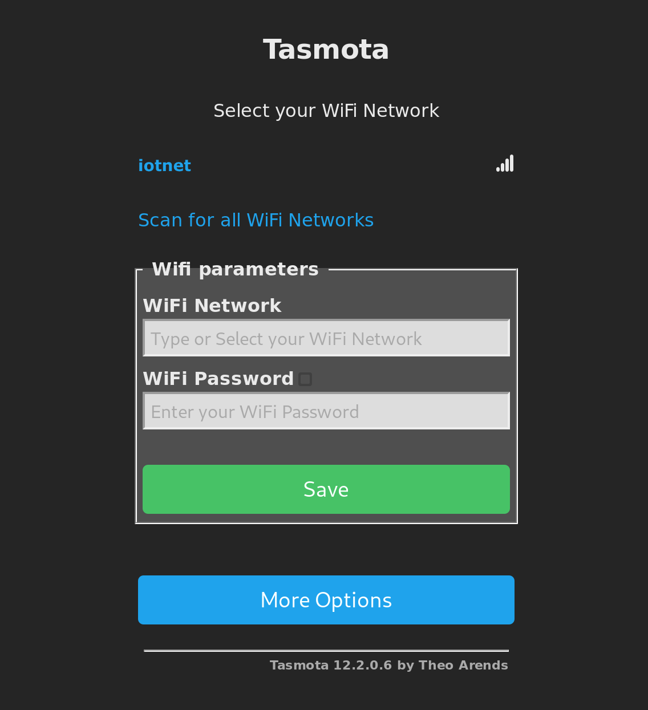
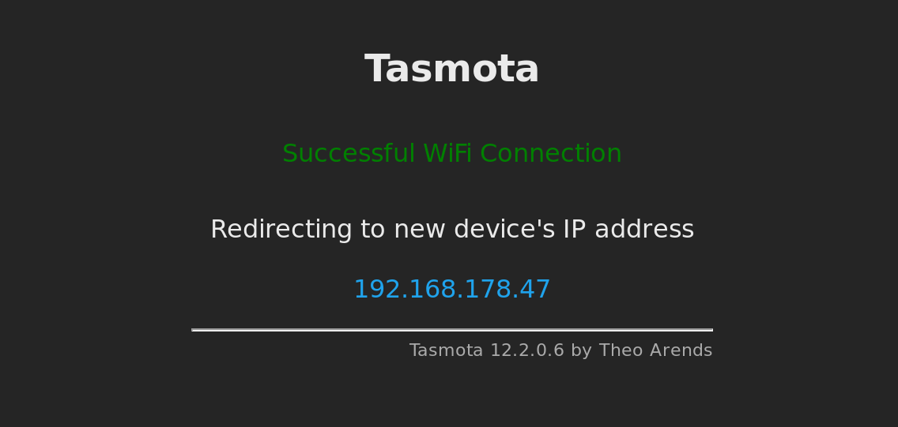
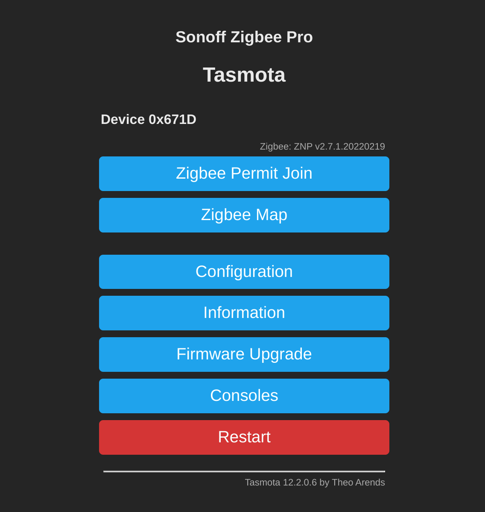
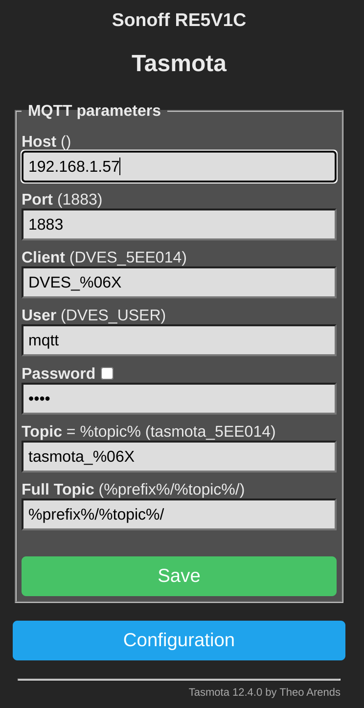

If you have purchased a device pre-flashed with Tasmota firmware, then the first thing you are going to want to do is get it connected to your network. If you are looking to newly flash a supported device and convert it to Tasmota, that is beyond the scope of this guide and you should refer to the [official documentation](https://tasmota.github.io/docs/Getting-Started/).

When you first power up a Tasmota device it will be in access point mode, it will broadcast its own WiFi network that you can connect to and configure your WiFi details. So grab your phone or your laptop and look for a WiFi network called `tasmota-xxxxxx-####` where the ‘xxxxxx’s will be replaced by a seemingly random string of numbers and letters, that uniquely identifies that Tasmota device.



Connect to this WiFi network and you should automatically get redirected to a login page that allows you to enter your WiFi credentials. If you are on a PC and don’t get redirected to the login page, then open a browser and navigate to [`http://192.168.4.1`](http://192.168.4.1).



Select your WiFi network from the list or manually type the name, enter your WiFi password and then click `Save`. After a few moments you should get the following screen showing that Tasmota has sucessfully connected to your WiFi. Make a note of the IP Address that is shown on this page as you are going to need this to connect to the device and make any configuration changes.



#### Connecting to the Tasmota UI

All Tasmota devices have a simple web UI running on the device, you can use this to apply any required settings such as MQTT configuration. Simply browse to the IP address shown from step 1 in your browser. If you don't know the IP address of your device you can try an [IP Scanner](https://angryip.org/) or check the logs of your router for connected devices, with a hostname starting with tasmota.



#### Connecting to Home Assistant

If you are using Home Assistant then you will want to connect your Tasmota devices so you can control them or view data from sensors. This will allow you to use them in automations or access the devices via the dashboard. If using a ZBBridge with Tasmota this does not apply, as these are not directly connected in Home Assistant but rather configured through ZHA or Zigbee2MQTT.

Tasmota uses MQTT to communicate with Home Assistant, this is a lightweight messaging protocol specifically designed for IoT devices. However its not setup by default in Home Assistant. If you havent already got an MQTT broker (server) running you will want to setup MQTT by installing the Mosquitto add-on, in Home Assistant.

From Home Assistant (skip these steps if you already have MQTT configured):
1. Navigate to `Settings -> Add-ons`, find Mosquitto and click `Install`, then start the add-on.
2. Navigate to `Settings -> Devices & Services`, find the auto-discoverd Mosquitto entry and click `Configure`.
3. Finally create a user in `Settings -> Users` that the Tasmota devices will use to connect.
More detailed instruction are in the [Moqsuitto add-on documentation](https://github.com/home-assistant/addons/blob/master/mosquitto/DOCS.md)

From the Tasmota Web UI you just need to put the details of your MQTT broker.
1. Navigate to `Configuration -> Configure MQTT`
2. Enter the following details
    * **Host:** This is the IP or hostname of your MQTT broker, most likely this is the same as your Home Assistant host. Note that Tasmota does not support mDNS so you cannot use the predefined local hostnames like `homeassistant.local`, you should use the IP instead.
    * **User:** Username of the Home Assistant user you created for mqtt
    * **Password:**  Password for the mqtt user
    * All other settings can remain at default values
3. Click `Save`



Once Tasmota connects, Home Assistant will auto-discover the Tasmota device. Navigate to `Settings -> Devices & Services`, find your new Tasmota device and click `Configure`, the device will now be added to Home Assistant.

#### Setting a Timezone

Tasmota cannot autodetect your timezone, however the timezone can be set with a one-time command from the Tasmota Console. Visit the [Tasmota Timezone Table](https://tasmota.github.io/docs/Timezone-Table/), find your timezone and it will show you the command to run. Open the console from the menu `Consoles -> Console` and run the command from the table.

For example for `Australia\Sydney` you would just enter this command in the console:
```
Backlog0 Timezone 99; TimeStd 1,1,4,1,3,600; TimeDst 1,1,10,1,2,660
```

#### Factory Reset

If you ever need to reset your device to the firmware defaults, there are a few options available. This may be necessary if you are unable to access the Tasmota UI due to an error in the configuration, or if you need to change the WiFi credentials to connect to a different network.
1. If your device has a reset button, press and hold this button for atleast 40 secs, the device will then reset and should be power cycled to complete the process.
2. For devices without a reset button or if the above doesnt work, you can use the quick power cycle reset. Power down for the device for 30 secs, then quickly power cycle the device 6 times within 10 secs each time. After this the device will restart and be reset back to firmware defaults.
3. If you still have access to the Web UI, you can also complete a reset in the Tasmota console. From the menu select `Consoles -> Console` then enter the command `reset 1` and hit enter.

##### Links

Check out the official documentation for more info:
[Tasmota Documentation](https://tasmota.github.io/docs)

Documentation for Mosquitto Addon, this page mentions a obsolete 'Supervisor' menu, which is now renamed to 'Settings' menu: 
[Mosquitto Documentation](https://github.com/home-assistant/addons/blob/master/mosquitto/DOCS.md)