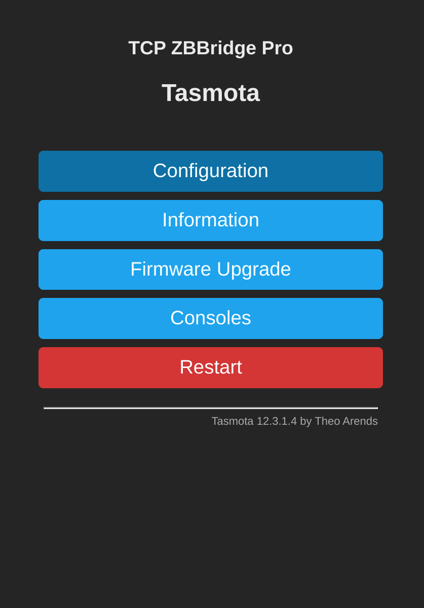
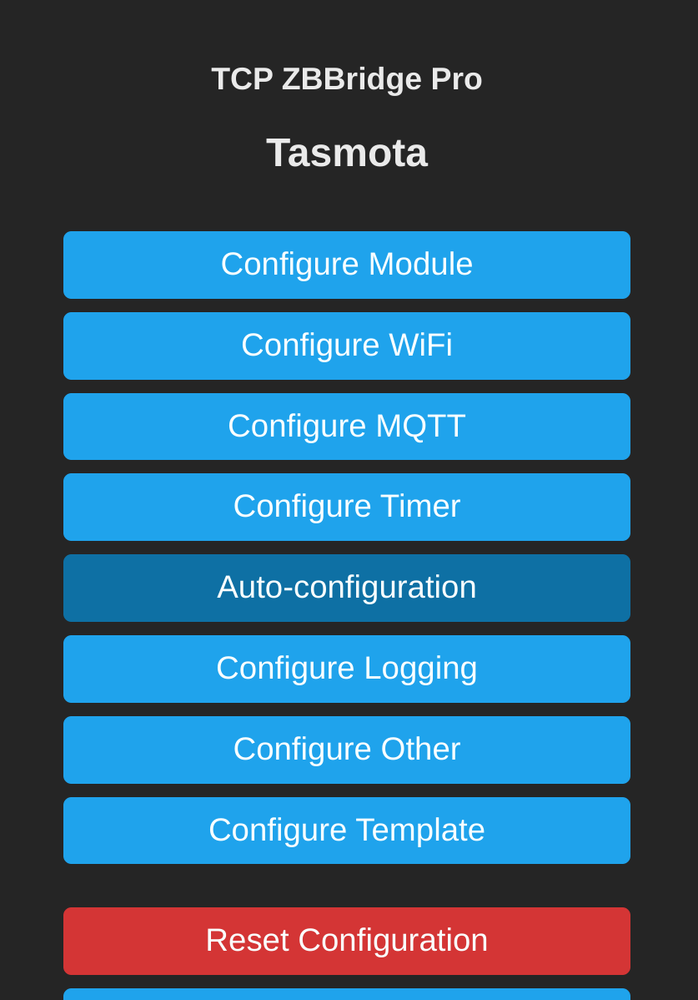
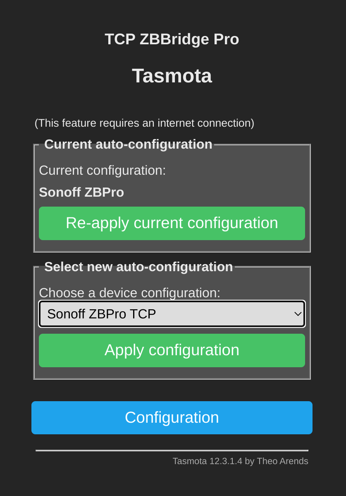
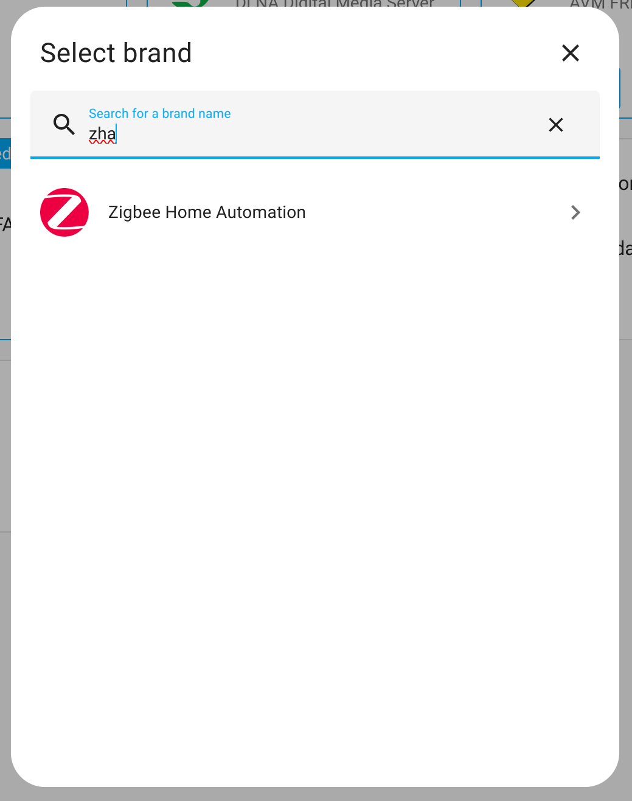
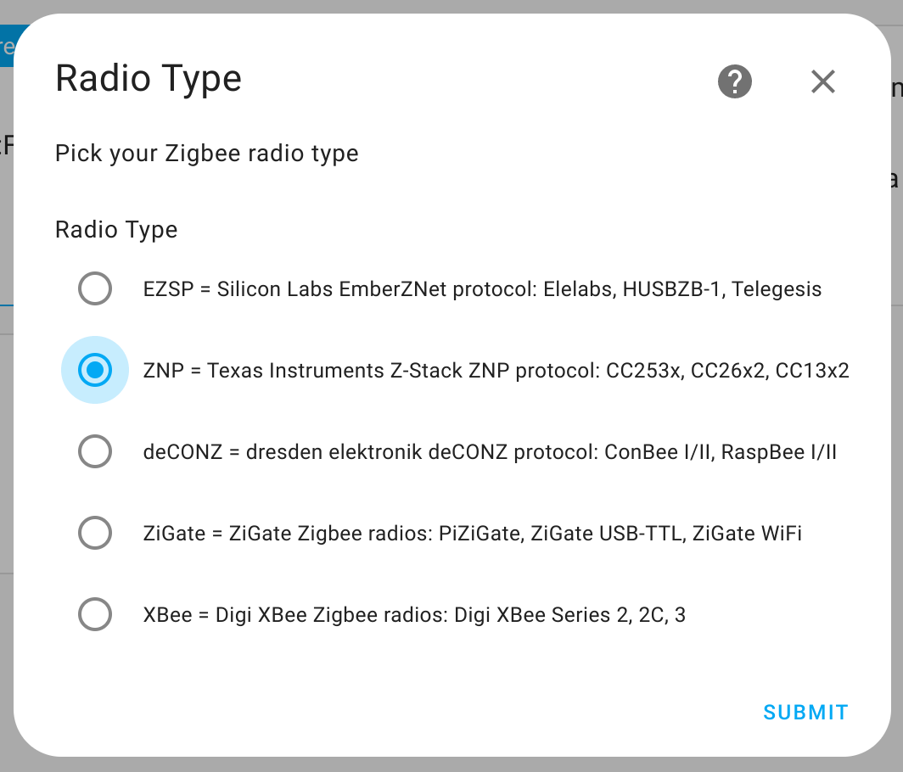
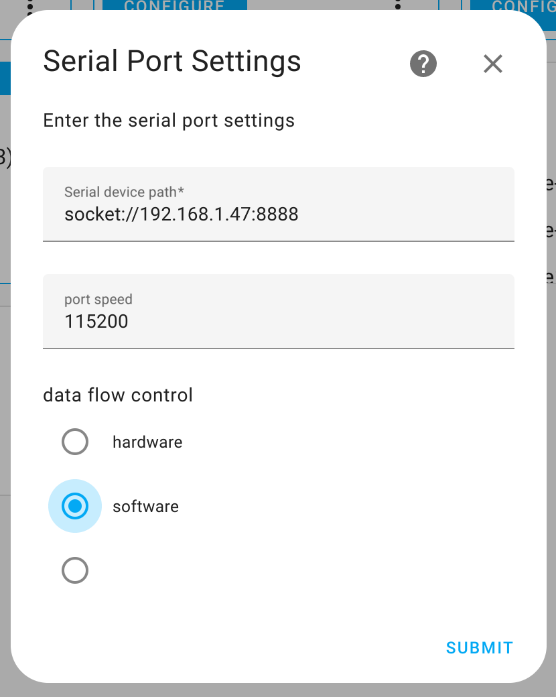
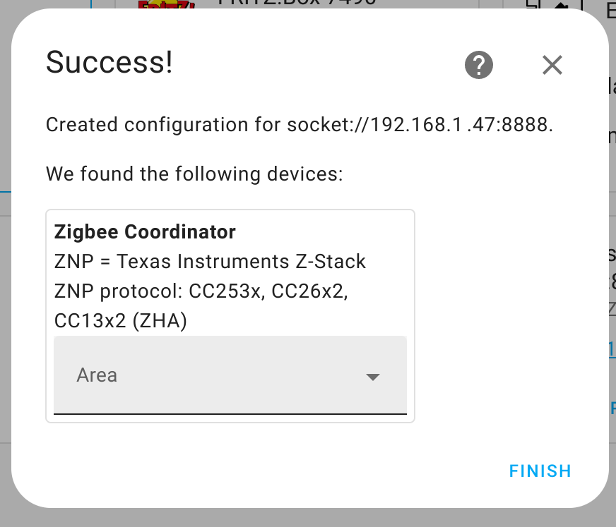
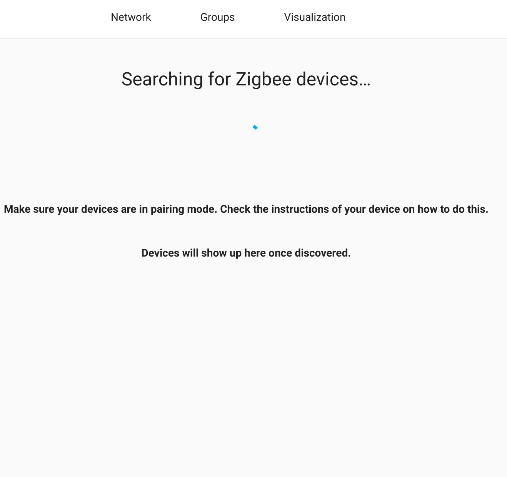
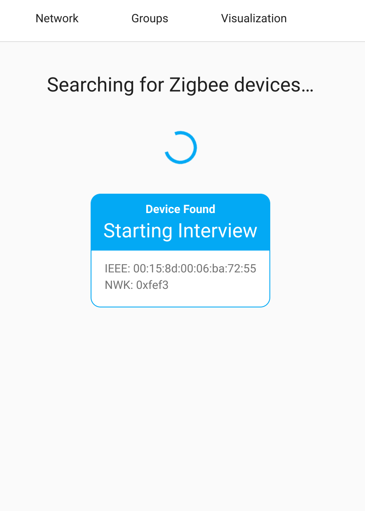
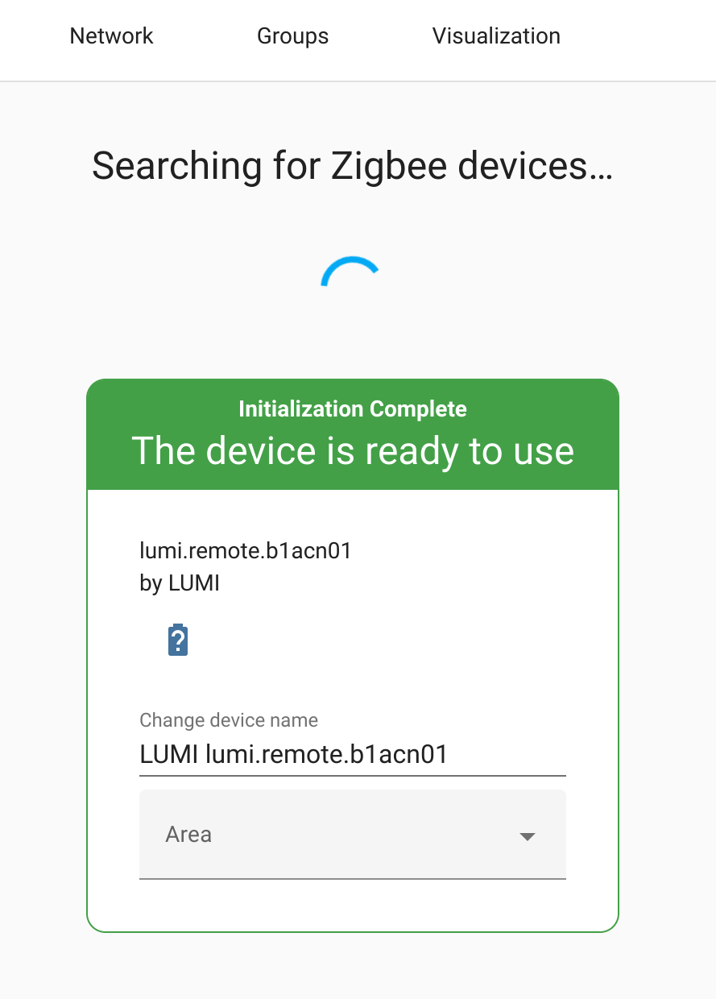

The Sonoff Zigbee Bridge Pro, when flashed with Tasmota, seamlessly integrates Zigbee with your favourite home automation platform. By adding a Zigbee gateway to your setup you can enjoy support for many different Zigbee devices from most of the different brands on the market including Sonoff, Aqara, IKEA, Tuya and many more. This guide assumes you have purchased a device pre-flashed with Tasmota and will run through the setup on Home Assistant using ZHA. 

<a href="https://shop.dialedin.com.au/products/sonoff-zigbee-bridge-pro-tasmota" style="display: block; text-align: center;">
Purchase ZBBridge-P Tasmota now</a>

### Tasmota Configuration
First, you will need to connect Tasmota to your WiFi and get the IP address of the ZBBridge-P. If you are new to Tasmota then you can find out all about how to do this in our [Getting Started Guide](tasmota-getting-started). Now conect to the Tasmota UI on the ZBBridge-P, we are going to load up the auto-configuration for TCP Serial Bridge mode which is used for integration with ZHA, Zigpy or Zigbee2MQTT.

From the menu navigate to `Configuration` -> `Auto-Configuration`. In the Dropdown box select `Sonoff ZBPro TCP` from the list and then click `Apply Configuration`. Your device will now restart and automagically be configured for use with Home Assistant using ZHA.

  

    
  

  

    
  

  

    
  

It is recommended to make sure your device has a static IP, since if the IP changes after a reboot at any time then Home Assistant will no longer be able to access the bridge and your Zigbee network will stop working. The easiest way to do this is to setup a static lease in the DHCP server on your ISP router, instructions for this will vary depending on what router your ISP provided you. So try googling your router model and *static lease* for instructions. If its not possible to do this in your router then you can also setup a static IP in Tasmota directly, see links at the end of this blog for info.

### ZHA Configuration
ZHA is the default Zigbee stack in Home Assistant, it is included by default and provides the nicest integration with the Home Assistant UI. We recommend using this if you are new to Home Assistant, which is why we are covering it in this guide. Zigbee2MQTT is also a solid option, providing support for many more Zigbee end-devices. However it is also more complicated to setup, so we will cover setting up Mosquitto MQTT and Zigbee2MQTT in a future guide.

Open Home Assistant and navigate to `Settings` -> `Devices & Services`. Click on `Add Integration` and search for `ZHA` and select `Zigbee Home Automation`. Then select the following options as shown in the screenshots below:
* Serial port: Enter Manually
* Radio Type: ZNP
* Serial device path: socket://[your_ip]:8888
* Data flow control: Software

  

    
  

  

    
  

  

    
  

  

    
  

Once you click submit on the final screen, you may get a `Network Formation` popup, select `Erase network settings and form a new network`. Home Assistant will now begin setting up ZHA. This will take a few of minutes, then you should get a message showing its completed successfully.

### Pair your first Zigbee device
To pair devices with your new Zigbee network, you need to enable pairing mode. This is done through Home Assistant by simply adding a new device. Navigate again to `Settings` -> `Devices & Services` -> `Add Integration`, this time you should see an `Add Zigbee Device` option near the top of the list. Once you click this, the Sonoff ZBBridge-P will enter pairing mode and will patiently wait for you to put your zigbee end device into pairing mode[^1]. Go ahead and press the pairing button on your device for about 5 seconds, ZHA will begin interiewing the device, and within a few moments the pairing will be complete.

[^1]: Note the physical button on the ZBBridge-P does not enable pairing mode.

  

    
  

  

    
  

  

    
  

Your device will now be available in Home Assistant and can be used in automations to control other devices on your network.

### General Zigbee tips

* You can only have one co-ordinator on a Zigbee network.
* Zigbee is a mesh network topology, you can add router nodes to extend range and capacity.
* Always pair end devices from near the location they will operate from, this will allow them to pair with the closest router node. You will also quickly become aware if there are range issues.

##### Links

Databases of supported devices:  
[Blakadder Zigbee Database](https://zigbee.blakadder.com/)  
[Zigbee2MQTT Supported Devices](https://www.zigbee2mqtt.io/supported-devices/)

Check out the official Home Assistant documentation for more info:  
[ZHA Integration docs](https://www.home-assistant.io/integrations/zha)

Manually set a static IP in Tasmota:  
[Tasmota static IP](https://hobbytronics.com.pk/config-sonoff-tasmota/#Static-IP-Address)

Want to flash a stock ZBBridge-P? This guide covers how to do that:  
[How to flash Tasmota on Sonoff ZB Bridge Pro](https://notenoughtech.com/home-automation/tasmota-on-sonoff-zb-bridge-pro/)