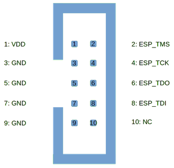

#### Introducing the ESP-Prog
The ESP-PROG is an essential tool for developers working with ESP32 devices. It offers seamless programming and online debugging capabilities, making development and troubleshooting easy. Online debugging allows you to set breakpoints, step through code and inspect variables, all while your code is running on the ESP32. It allows you to quickly find bugs in your code, without littering your code with print statements to try and see what is going on inside the mircocontroller.

Arduino IDE is a great entry-level tool for beginners just get started in programming ESP32's, however it is lacking the advanced features required to really take advantage of the ESP-Prog debugging features. So for this tutorial we will use PlatformIO which is an extension for Visual Studio Code (VSCode).

VSCode is a fully-featured code editor that includes advanced features such as code completion, syntax highlighting, and error checking. PlatformIO (PIO), on the other hand, is an extension for VSCode that adds even more functionality, including integration with a wide variety of development boards, debugging tools, and library management. Together, these tools allow for a much more efficient and streamlined development process. You can install both tools for free from the link below:

[Install PlatformIO](https://platformio.org/install/ide?install=vscode)  
You will also need to install drivers to get debugging working, you can find instructions for various platforms [here](https://docs.platformio.org/en/stable/plus/debug-tools/esp-prog.html#id2).

 Requirements for completing this tutorial
 - VSCode with PlatformIO extension and drivers installed
 - ESP32 Devkit such as [ESP32-DevkitC-v4](https://shop.dialedin.com.au/products/esp32-devkitc-v4). Note: online debugging is not supported on the ESP8266 series.
 - [ESP-Prog](https://shop.dialedin.com.au/products/espressif-esp-prog) Programmer and debug board
 - Dupont Jumper cables

#### Wiring up the ESP32 to the ESP-Prog JTAG port
When using the ESP-Prog, you'll need to connect the pins on the JTAG port to the corresponding pins on your ESP32 development board, using dupont jumper wires. The pinouts for each are shown below, you must connect each of TMS, TCK, TDI, TDO and GND. While the ESP-Prog provides a VCC Pin on the JTAG header, it does not provide enough power to reliably power most ESP32 devkits. Using this to power the ESP32 will likely cause intermittant issues that are hard to troubleshoot, so we recommend powering the board under test from the built-in USB port or another dedicated power supply. Never connect the VCC pin from the ESP-Prog to an ESP32 board that is already powered.

  
*ESP-Prog JTAG Pinout*

|Pin Name      | Function              | GPIO Pin Number  |
|--------------|-----------------------| -----------------|
|TMS	         | Test Mode Select      | GPIO14           |
|TDI	         | Test Data In	         | GPIO13           |
|TDO	         | Test Data Out	       | GPIO12           |
|TCK	         | Test Clock	           | GPIO15           |
| GND          | Ground                | GND              |
{: .table .table-responsive}
*Table: ESP32 JTAG pins*

It is important to note that not all JTAG pins are available on some ESP32 development boards, make sure you select a board that has them all broken out to pin headers. The pin number may vary depending on the specific ESP32 board you are using. It is important to refer to the board's documentation or schematic to confirm the pin assignments.

For this tutorial connect the development board to a USB port on your computer, we will use the USB port of the ESP32 devkit as the serial port monitor, this will display any log messages in your program. We will then use the JTAG port for programming and debugging.

#### Create an example arduino-blink project
We will start with an example arduino project that includes code ready to blink an LED. Optionally, you can connect an LED to GPIO 2 on your Development kit. Open up VSCode and click on the PlatformIO (we will refer to PIO from here on in) icon to get to the PIO Home page. On this page under `Quick Access` items select `Project Example` then find the arduino-blink project in the list.


Platform IO will generate a skeleton project with all the files needed to build and upload this project to your device. We will make some changes to the config to make this work with the ESP-Prog and also add some additional code to test the serial monitor and provide a variable to inspect with the debugger


##### Update files in the example project
First we are going to make some minor changes to the example project that PlatformIO generated. Alternatively you can download the complete project from our git repo [Esp-Prog Sample Project](https://github.com/DialedIn-Aus/esp-prog-sample) and open this directly in Platform IO.

Replace the contents of the `platformio.ini` file with the following code.
```
; PlatformIO Project Configuration File
;
;   Build options: build flags, source filter, extra scripting
;   Upload options: custom port, speed and extra flags
;   Library options: dependencies, extra library storages
;
; Please visit documentation for the other options and examples
; http://docs.platformio.org/page/projectconf.html

[env:esp-prog]
platform = espressif32
board = esp32dev
framework = arduino

monitor_speed = 115200
monitor_port = /dev/ttyUSB0
monitor_filters = esp32_exception_decoder

; upload via esp-prog JTAG
upload_protocol = esp-prog
debug_tool = esp-prog
debug_init_break = tbreak setup
```

Now that the base configuration is loaded you can use the PlatformIO UI to update settings, this will allow you to select options from dropdown list. For example there are hundreds of boards available in PlatformIO, if your specific board is listed then you can use this for the `board` setting. This can be found under `PIO Home` > `Projects` -> Your project -> `Configure`

A breif overview of key settings above:  
`board`: Set your development board here, PIO has lots of builtin boards, however if yours isnt listed then use the generic `esp32dev` which will work with most ESP32 boards, such as the popular [ESP32-DevkitC-v4](https://shop.dialedin.com.au/products/esp32-devkitc-v4).

`monitor_port`: Needs to be set to the serial port of your development kit. This is platform dependent, on windows it will be something like `COM4` on Mac it maybe something like `/dev/tty.usbserial1`. You can check what ports are in use under `PIO Home` -> `Devices` tab. In the screenshot below, `/dev/ttyUSB0` is the development board and remaining two are the ESP-Prog ports.


`monitor_filters`: The `esp32_exception_decoder` filter will print a nice stacktrace to the serial monitor if your code crashes the ESP32.

`upload_protocol` and `debug_tool`: Set uploads and debugger to use the ESP-Prog. There is no need to a serial `_port` option for these as the JTAG interface will be autodetected by PIO.

`debug_init_break`: causes the debugger to break on the Arduino `setup()` function, it is otherwise not possible to use breakpoints in this function, so this is a handy workaround. You can comment out this line if not needing to debug any setup code.

Next, update the blink source code in `src/Blink.cpp` with the below. 
```
/*
 * Blink
 * Turns on an LED on for one second,
 * then off for one second, repeatedly.
 */

#include <Arduino.h>
int led_state;
// Set LED_BUILTIN if it is not defined by Arduino framework
#define LED_BUILTIN 2

void setup()
{
  // initialize LED digital pin as an output.
  pinMode(LED_BUILTIN, OUTPUT);

  // initialise the serial monitor port
  Serial.begin(115200);
  delay(1000);
  Serial.println("Welcome to PlatformIO");
}

void loop()
{
  
  // turn the LED on (HIGH is the voltage level)
  digitalWrite(LED_BUILTIN, HIGH);
  led_state=1;
  Serial.println("LED On");

  // wait for a second
  delay(1000);

  // turn the LED off by making the voltage LOW
  digitalWrite(LED_BUILTIN, LOW);
  led_state=0;
  Serial.println("LED Off");

   // wait for a second
  delay(1000);
}
```
This makes some minor additions to the code, first it sets up the serial monitor and prints some messages to it. It also adds a variable to track the state of the LED, you will be able to view the value of this variable while debugging.

#### Running a debug session
You are now ready to build the project, in the PIO menu, select Build. A bunch of text will scroll past in the terminal and after a few moments it should show it completed with success.

{% include lightbox.html src="blog/esp-prog/Platformio-menu-build.png" data="group1" style="max-width:40%" title="Platformio build menu" %}
 



Now you can upload the code and test the serial monitor by clicking on `Upload and Monitor` in the PIO menu. More text will fly past as the firmware is uploaded and once this is complete you should start to see messages from the ESP32 as it turns the LED on and off.



Now lets fire up the debugger and step through code running on the ESP32. Hit the play button in the sidebar menu, then click the play button near the top of the screen. PlatformIO will set things up and then in a few moments, execution should stop at the arduino `setup()` function. You are now hanging out inside the ESP32 and have full control over the code execution.  You will be able to view the state of variables and set breakpoints.  



To setup a breakpoint, you find the code you want to stop at, and then click to create a red dot in the column left of the numbers. When you click 'continue' in the debug controls, execution will resume until it reaches the next breakpoint. Once you have hit this breakpoint, you can navigate through the variables window in the sidebar to find the `led_state` variable (its under nested under global) and see what its current value is. In the screenshot we have added this variable to the watch list so that its always visible anytime the debugger halts execution. 



Debug controls (from left to right in image below)  
**Continue** - Resume execution, stop at next breakpoint.  
**Step Over** - Advance execution to the next line of code.  
**Step Into** - Execute the current line, if this is a function, then the debugger steps into that function.  
**Step Out** - Execute the rest of the current function, stopping up at the next level where that function was called.  
**Restart** - Restart the current debug session and execute program from the beginning.
**Stop** - End the current debug session.  

At anytime during the debugging session you can switch to the terminal tab to view the serial monitor output.

{% include lightbox.html src="blog/esp-prog/Platformio-debug-controls.png" data="group1" style="max-width:40%" title="Platformio debug controls" %}  
  
You have now successfully used the ESP-Prog to interactively debug your first ESP32 program. If you dont have an ESP-Prog yet, then you can purchase this essential tool from the link below. This is a game-changer and you will quickly wonder why you were previously stuffing print statements everywhere to debug!


[Purchase the ESP-Prog JTAG Downloader and Debugger Now](https://shop.dialedin.com.au/products/espressif-esp-prog)  

###### Links
[Esp-Prog Sample Project](https://github.com/DialedIn-Aus/esp-prog-sample)   
[PlatformIO ESP-Prog Documentation](https://docs.platformio.org/en/stable/plus/debug-tools/esp-prog.html)
