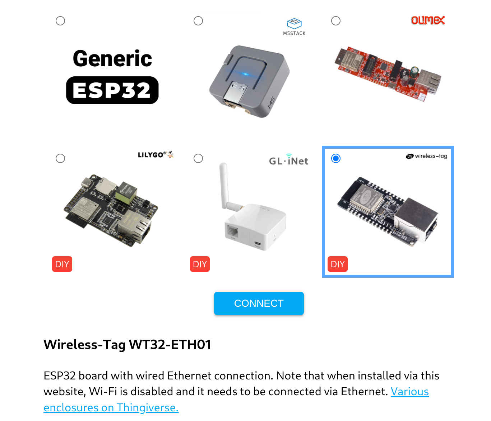
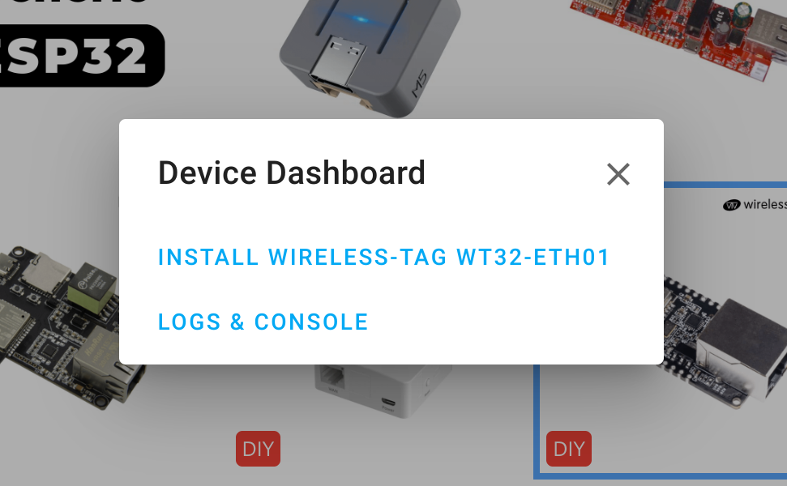
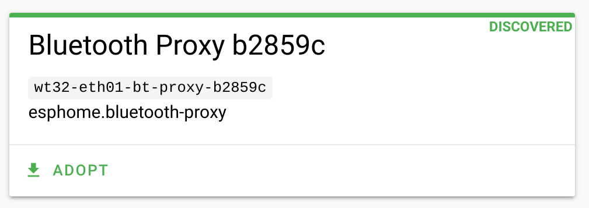
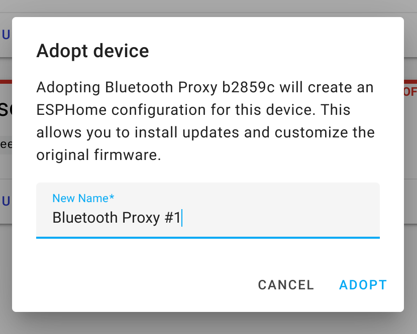
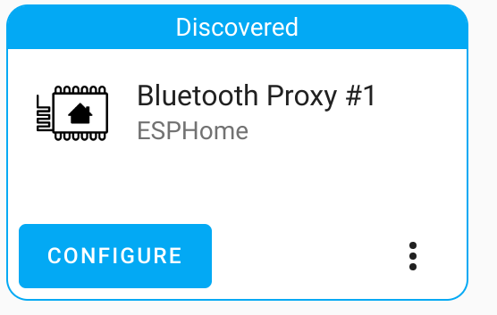

The WT32-ETH01 is an embedded serial to Ethernet module based on the ESP32 series designed by Wireless-Tag. It features RJ45 network port that supports 10/100Mbps speed connections allowing to create ethernet based IoT devices. It also supports Wi-Fi and Bluetooth protocols, making it a versatile device for IoT applications that require alternate connectivity. These modules are compatible with Arduino IDE, Tasmota, ESPHome and most other popular ESP32 based projects and distributions.

In this blog post, we will show you how to flash the WT32-ETH01 with the ESPHome Bluetooth Proxy firmware and set it up in Home Assistant as a device that can extend its Bluetooth reach by bridging Bluetooth connections over your LAN. This way, you can integrate more Bluetooth devices into your smart home system without worrying about the limited range of Bluetooth technology.

### What you need

To follow this tutorial, you will need:

- A [WT32-ETH01 module](https://shop.dialedin.com.au/products/wt32-eth01-wifi-ethernet-devkit)
- A [USB-to-UART adapter](https://shop.dialedin.com.au/products/ch341t) (such as CP2102 or CH340)
- Some dupont jumper wires
- A Home Assistant instance with ESPHome integration enabled

If you have purchased the WT32-ETH01 pre-flashed with ESPHome, you can skip over the section on flashing the device and head straight to [setup in Home Assistant](#setup-in-home-assistant).

### Flashing ESPHome

The first step is to flash the WT32-ETH01 module with ESPHome firmware. To do this, you need to connect the module to your computer using the USB-to-UART adapter and put it into bootloader mode. Make sure your UART adapter supports and is set to 3.3V mode.

To connect the module to your computer, you need to connect four pins: GND, TX0, RX0, 3v3. You also need to connect GPIO0 to GND temporarily to enter bootloader mode and allow download of the firmware. The connection diagram of the module is shown below:

| WT32-ETH01 Pin | USB UART Adapter Pin |
| --- | --- |
| TXD | RXD |
| RXD | TXD |
| GND | GND |
| 3V3 | 3V3 |
{: .table .table-responsive}

Make sure to properly connect these pins from within the green box in the below image to the corresponding pins on the USB UART adapter, take note of the TX -> RX connections to ensure communication suceeds. Additionally, connect GPIO0 to Ground before applying power to put the board into programming mode before flashing the firmware with ESPHome. You can use a spare jumper wire to connect the 2 pins in the red box.

{% include lightbox.html src="blog/wt32-eth01-wiring.png" data="group1" style="display: block; margin: 0 auto;max-width:80%" title="WT32-ETH01 Progamming Pins" %}

Use the two pins in the purple box to power the device normally with 5V, once you have completed the flashing process.

#### Web Installer
With the USB Uart serial adapter and WT32-ETH01 all wired up, proceed to the [web installer site](https://esphome.github.io/bluetooth-proxies/?diy). If you don't see the WT32-ETH01 displayed, make sure to click the 'DIY Expert' link at the very bottom of this page.



Select the `Wireless-Tag WT32-ETH01` Device and click 'Connect'. On the window that pops up, select the correct COM port that corresponds to your USB-to-UART adapter (you can check it in Device Manager on Windows or ls /dev/tty* on Linux) and click 'Connect' again. If everything is wired up correctly, you should see the following pop-up displayed:



Click 'Install', Confirm installation, then wait for the flashing process to complete. This process will take around 2-3mins to complete.

### Setup in Home Assistant

This device needs to be powered by a 5V supply for normal operation, connect this to the 2 pins shown in the purple box in the previous pinout image of the WT32-ETH01 pinouts. Now you are ready to plug the device into your ethernet network.

NB: WiFi is disabled in the pre-built Bluetooth proxy firmware. If you wish to use Wifi you will need to first connect via ethernet and reload a configuration with WiFi enabled. 

Head to your ESPHome Dashboard where you should see a `Bluetooth Proxy` device ready to be adopted to ESPHome. Click on the green Adopt button, give the device a suitable name and click to adopt. ESPHome will now start installing the device, during these time a lot of lines of text will scroll past, but after a couple of minutes is should be completed.
<div class="blog-row fullWidth py-5">

  <div class="col-lg-3 col-sm-4">
    
  </div>
  <div class="col-lg-3 col-sm-4">
    
  </div>

</div>

The final step is to configure the proxy device in Home Assistant, naviagte to `Settings -> Devices & Services` menu or click on the devices discovered notification. You should see the Proxy device has been discovered and you just need to click the 'Configure' button. 



Configuration is now complete, any Bluetooth device within range of your new Bluetooth proxy will get sent to Home Assistant. If it is a device that is supported by Home Assistant, this device will be discovered and available to setup from the `Devices & services` screen.

If you made it this far, let us know in the comments how you went!

### Advanced ESPHome Usage
ESPHome is a very powerful platform with support for many sensors, relays, displays and more. It is possible to use this device for far more than just the Bluetooth proxy, by making your own custom firmware utilising any of the supported components. Simply add the following code to your ESPHome YAML file to enable the ethernet port. You can retain the Bluetooth Proxy feature as well in your custome firmware, see the documentaion for all the details.    

```yaml
ethernet:
  type: LAN8720
  mdc_pin: GPIO23
  mdio_pin: GPIO18
  clk_mode: GPIO0_IN
  phy_addr: 1
  power_pin: GPIO16
```


#### Links
ESPHome:  
[Bluetooth proxy installer](https://esphome.github.io/bluetooth-proxies/?diy)  
[Bluetooth proxy docs](https://esphome.io/components/bluetooth_proxy.html)  
[Ethernet Docs](https://esphome.io/components/ethernet.html?highlight=lan8720)  

WT32-ETH01 
[Datasheet](http://www.wireless-tag.com/wp-content/uploads/2022/10/WT32-ETH01_datasheet_V1.3-en.pdf)