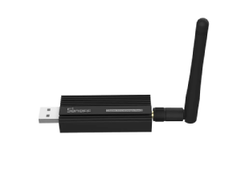
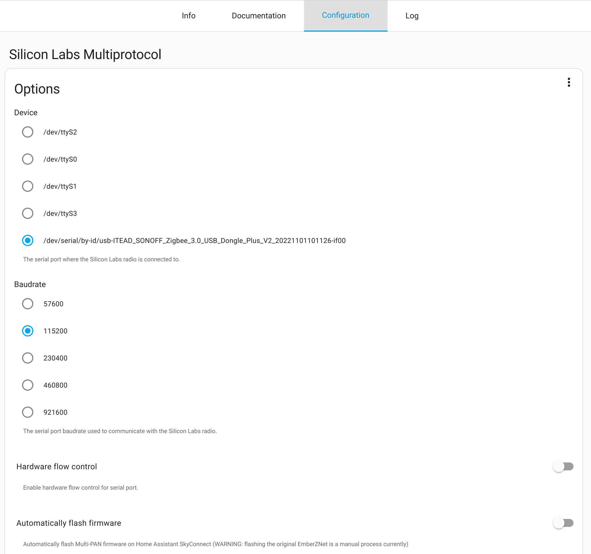
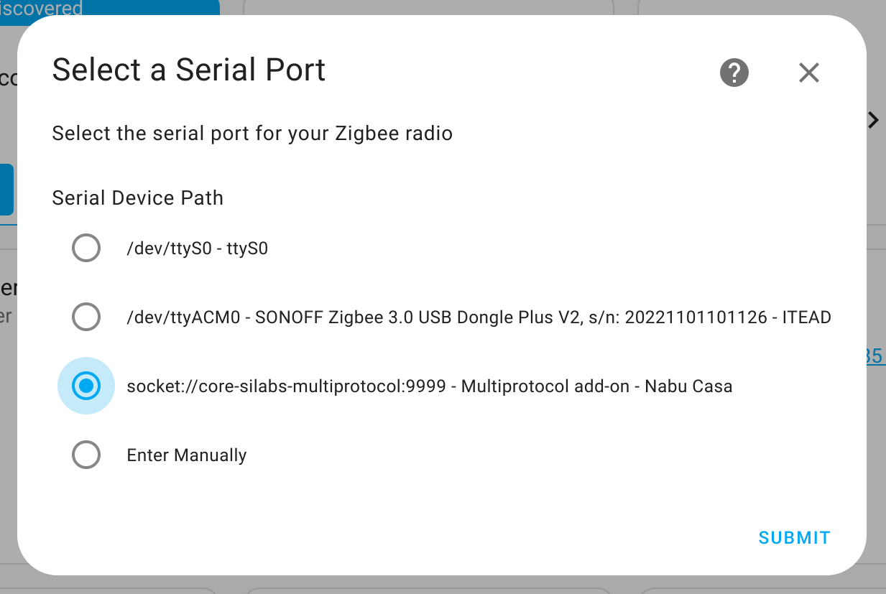

**UPDATE 9/5/2023**: *Updated firmware links for Gecko SDK v4.2.3 release, also added a [web flasher](#web-flasher) to this blog post so you can quickly flash your dongle in the browser directly from this post!*

**UPDATE 14/6/2023**: *Silabs Multiprotocol Addon 2.2 has been released and requires the dongle firmware to be updated to 4.3.0. If you previously followed this guide you will need to update to the new version. Updated firmware links and web-flasher for Gecko SDK v4.3.0 release have been added to this blog*

There are two buzzwords domininating the home automation world in 2023, 'Matter' and 'Thread', that promise to fix many of the shortcomings with existing platforms, in particular by improving interoperability between smart home devices from different vendors. The folks at Nabu Casa (the company behind Home Assistant) have been hard at work bringing support for these protocols to Home Assistant. Currently they are focusing on support for their own hardware devices, SkyConnect and Home Assistant Yellow, however the ZBDongle-E is based on the same Silicon Labs EFRMG21 chipset, so with a few more manual steps it can also work. 

In this blog post we will cover flashing your ZBDongle-E or ZB-GW04 Dongles with the a RCP MultiPAN firmware and setting up a Zigbee network using this firmware. A Future blog post will cover Matter and Thread in more detail, however they will also be working at the end of this post.

**DISCLAIMER:** Everything in the blog post is experimental. Flashing the wrong firmware could brick your adapter. There are a lot of moving parts as Matter and Thread support lands in Home Assistant and the other open source platforms, things could break at anytime, or may not work to start with. So dont try this on your production server just yet! However if you are brave continue onwards. None of this is officially supported by iTead(Sonoff) or Nabu Casa (Home Assistant).

You can purchase a dongle to flash from our store.
* [Purchase ZBDongle-E](https://shop.dialedin.com.au/products/sonoff-zbdongle-e)
* [Purchase ZB-GW04 v1.2](https://shop.dialedin.com.au/products/zb-gw04-v1-2-zigbee-dongle)

#### Matter and Thread
Matter is an IoT protocol developed by the Connectivity Standards Alliance (formerly the Zigbee Alliance) that aims to standardize the way smart home devices communicate with each other. Matter is designed to be compatible with various smart home devices, regardless of the brand or manufacturer. This interoperability is expected to make it easier for users to set up and manage their smart home systems, as they can mix and match devices from different brands.

Thread, on the other hand, is another wireless communication protocol that was also developed by the Connectivity Standards Alliance. It is the successor to Zigbee. Thread is designed specifically for low-power, Internet of Things (IoT) devices and provides a secure and reliable way for devices to communicate with each other. Thread uses a mesh network topology, which means that devices can communicate with each other even if they are out of range of the central hub.

Together, Matter and Thread are expected to revolutionize the smart home automation industry by providing a standardized, secure, and reliable way for devices to communicate with each other. This will make it easier for homeowners to set up and manage their smart home systems and create a seamless, integrated home environment.

#### Firmware Types

Traditionally Zigbee Coordinator dongles use a Network Co-Processor (NCP) based firmware. In this case the Zigbee application is running on the dongle, which handle the majority of management of the Zigbee network. You Zigbee integration communicates with the dongle to just send/recieve data to the Zigbee end devices. 

More recently there have become available Remote Co-Processor (RCP) based firmwares, in this case the Zigbee application is offloaded to your server (Home Assistant in this case), and the dongle provides only the hardware level radio support. When using an RCP firmware, the option for MultiPAN config allows support for multiple networks, this provides a unique advantage in that now you can have both Zigbee and Thread networks running on the same dongle simultaneously.

The ZBDongle-E ships from the factory with a NCP firmware v6.10.3, if you are just wanting to use Zigbee we recommend you stick with this firmware.

#### Web Flasher
**UPDATE 9/5/2023**: You can now flash your ZBDongle-E directly from the browser.

Thanks to the power of [SL Web Tools](https://github.com/NabuCasa/sl-web-tools) and some work done by our lead engineer [Darkxst](https://github.com/darkxst/sl-test), it is now possible to flash your ZBDongle-E from your browser, directly from this blog post. This requires the use of Chrome or Edge browsers and should work on Linux, Mac and Windows.

Click the `Flash` button below, you will then need to select your dongle (serial port) in the first pop-up and click connect. It will take a moment to probe your dongle then select `Change Firmware` and select Multi-PAN(RCP) and `Install`. It will take about one minute to flash and you are done.

When you get to the settings in Silicon Labs Multiprotocol addon configuration, you will need to use baudrate 460800 and disable the hardware flow control option.

> Your browser does not support the WebSerial API. Try Chrome or Edge instead.
{: #notSupported .hidden .serialErr }

<div class="col-lg-6 col-sm-6">
  Sonoff Zigbee 3.0 USB Dongle Plus V2

  
  <div class="Supported text-center">
      <nabucasa-zigbee-flasher manifest="/assets/manifests/zbdongle-e.json">
          <span slot="button">Flash</span>
      </nabucasa-zigbee-flasher>
  </div>
</div>
<br>


Once flashed via the web flasher you can skip the next section and head straight  to [Setup](#setup-in-home-assistant) Home Assistant.

#### Flashing the dongle
To flash new firmware onto the ZBDongle-E we will use the Universal Silabs Flasher [^1] tool. There is no need to disassemble the dongle to access the boot button as these tools can automatically put the device into bootloader mode, ready for firmware upload. 

[^1]: [Universal Silabs Flasher Tool](https://github.com/NabuCasa/universal-silabs-flasher)

You are going to need Python3 installed on your system. If you are running Linux, its already installed. For Windows or Mac you will need to install Python. You can [download from here](https://www.python.org/downloads/).

Once you have a functioning python environment you can go ahead and install the flasher tool, just run the following command.
```
pip3 install universal-silabs-flasher
```

For the steps that follow you are going to need to know the serial port of your ZBDongle-E. Plug the device in then check your platform specific commands below:
* Linux: Check with `ls /dev/tty*` it will probably be `/dev/ttyACM0` or `/dev/ttyUSB0`
* Windows: Check in device manager, it will likely be `COM5` or similar
* Mac: Check with `ls /dev/tty.usb*` you should find similar to `/dev/tty.usbserial20375`

If you are running Home Assistant in a Virtual Machine or Docker, make sure you pass the serial port of your adapter through to Home Assistant **after** flashing is complete.

Download the following:
* [ MultiPAN RCP Firmware ZBDongle-E ](https://raw.githubusercontent.com/darkxst/silabs-firmware-builder/main/firmware_builds/zbdonglee/rcp-uart-802154-v4.3.0-zbdonglee-460800.gbl)
* [ MultiPAN RCP Firmware ZB-GW04 v1.2 ](https://raw.githubusercontent.com/darkxst/silabs-firmware-builder/main/firmware_builds/zb-gw04-1v2/rcp-uart-802154-v4.3.0-zb-gw04-1v2-230400.gbl)

To flash the firmware, use the following command, making sure to update with the correct serial port for your device and the firmware filename. 
```
universal-silabs-flasher --device /dev/ttyACM0 \
    flash --firmware ./<firmware-filename>.gbl
    --allow-cross-flashing
```

A bunch of text will scroll past as the flasher probes your device and then flashes the firmware. As long as there are no errors, your device is now flashed successfully. You may need to reset the dongle by unplugging and plugging in again before continuing to setup in Home Assistant.

You can also use the above tool to flash any other firmwares such as a Zigbee router firmware to your dongle or even revert to the iTead factory firmware[^2].

[^2]:[ZBDongle-E factory firmware](https://github.com/itead/Sonoff_Zigbee_Dongle_Firmware/blob/master/Dongle-E/NCP/ncp-uart-sw_EZNet6.10.3_V1.0.1.gbl?raw=true)

#### Setup in Home Assistant
Make sure you are running the latest version of Home Assistant. Each new month brings a large update to these components. Testing for this blog was done on the 2023.3 March release, if you are running an older version update Home Assistant first.

##### Silabs Multiprotocol Addon
A core component of the stack when running an RCP firmware is the Silabs Multiprotocol Addon, this acts as the gateway between your dongle and Home Assistant. It also runs the protocol specific servers, for coordinating your Zigbee and/or Thread networks. Your ZHA or Zigbee2MQTT integrations will communicate with this addon rather than directly with the dongle. It also allows you to run Thread simulataneously as well.

Goto `Settings -> Add-ons` and install the `Silicon Labs Multiprotocol` Add-on. On the Configuration page, select your device, then set the following settings for firmware linked above. If you use a different firmware adjust these values accordingly.
* ZBDongle-E: baudrate: 460800 and disable hardware flow control and disable automatic firmware updates.
* ZB-GW04 v1.2: baudrate 230400, enable hardware flow control and disable automatic firmware updates.


You can now start the add-on. Check the logs tab to make sure it has connected to your ZBDongle-E and that there are no errors.

You can only use one of the following Zigbee integrations, they can not co-exist at the same time.

#### ZHA
If you had an existing ZHA setup, you will need to remove this entirely. Make sure to backup your network first!

Goto `Settings -> Devices & Integrations` and click the `Add Integration` Button.
ZHA will now ask which device you want to connect to, make sure you select the Multiprotocol add-on device.



On the next screen its recommended to start with an empty network and and then pair all your Zigbee devices. If you had a previous setup, you can try and import your previous network backup, ZHA will then try too migrate your devices to the new network, which may or may not work, some device may still require re-pairing if they are not functioning properly.

*Note: Home Assistant may automatically discover your ZBDongle-E device, however you should not proceed to configure this, as it will try and setup the traditional Zigbee config which wont work. You can safely ignore this by selecting `Ignore` from the 3 dot menu.*

#### Zigbee2MQTT
If you instead prefer to use Zigbee2MQTT, this can also connect to the Silabs Multiprotocol Add-on. Install Zigbee2MQTT as per [these instructions](https://github.com/zigbee2mqtt/hassio-zigbee2mqtt#installation) but modify the serial settings to connect to the Silabs addon instead of directly to the dongle.

On the `Configuration` tab enter the following under the Serial section:

```
port: tcp://core-silabs-multiprotocol:9999
adapter: ezsp
```

You can then start the add-on and check the logs to make sure it connected successfully.

Again its recommended to start with an empty network and pair all your devices. If you had a pre-existing Zigbee2MQTT, it maybe be possible to migrate your existing devices however this can be a hit and miss.

#### Matter and Thread
If you wish to experiment with Matter and/or Thread you will need to setup the relevant integrations, the Thread integration connects to the Silabs Multiprotocol Add-on to provide support for Thread devices. The Matter integration (and Matter Server add-on) co-ordinates provisioning and control of all Matter WiFi and Thread devices.

See the below links to the documentation. We will cover this in more detail in a future blog post!

Let us know in the comments how you went!

#### Links
[Latest Silabs Firmware Builds](https://github.com/darkxst/silabs-firmware-builder/tree/main/firmware_builds)  
[Sonoff Zigbee Router Firmware](https://github.com/itead/Sonoff_Zigbee_Dongle_Firmware/tree/master/Dongle-E/Router)

[Home Assistant Matter integration](https://www.home-assistant.io/integrations/matter)  
[Home Assistant Thread integration](https://www.home-assistant.io/integrations/thread)


[Zigbee2MQTT addon installation](https://github.com/zigbee2mqtt/hassio-zigbee2mqtt#installation)

[Reference implementation of SL Web Tools](https://github.com/darkxst/sl-test)

<script 
  type="module" 
  src="https://unpkg.com/@nabucasa/sl-web-tools@0.10.0/dist/web/nabucasa-zigbee-flasher.js?module">
</script>

<script>
  if(!navigator.serial){
    document.getElementById("notSupported").classList.remove('hidden');
  }
</script>