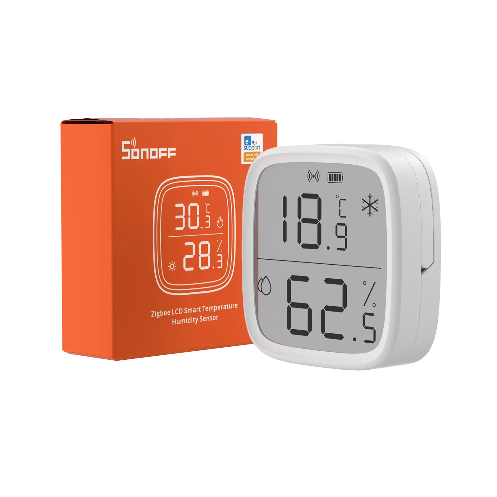

### Gateways

Sonoff has been making waves in the smart home industry, and their line of Zigbee products is no exception. They have a range of Zigbee Gateways, all of which are compatible with the various open automation platforms, such as Home Assitant, OpenHab and Jeedom. Having a suitable Zigbee gateway is a prerequisite to using any Zigbee device, and Sonoff's range of gateway products provide a great way to get up and running with a Zigbee network in your home.

Whether you're looking for a compact and portable solution, or a more powerful central hub, there's a Sonoff Zigbee product to suit your needs. In this review, we'll take a closer look at these gateways and sensors, and see how they can help you take your smart home to the next level.

[Sonoff Zigbee Bridge](https://shop.dialedin.com.au/products/zbbridge): This gateway device was the first of its kind from Sonoff, and it serves as the central hub for all your Zigbee-compatible devices. With its simple setup process, the Zigbee bridge creates a bridge between you WiFi network and Zigbee. The Zigbee Bridge makes it easy to connect all your smart home devices and control them using the eWeLink app. It can also be flashed with Tasmota, allowing it to act as a Zigbee Hub for your open automation platform such as Home Assistant. However this product is now obsolete and is being replaced by the Zigbee Bridge Pro. We still however have limited stock of this item remaining in both eWeLink and Tasmota versions. 

[Sonoff Zigbee Bridge Pro](https://shop.dialedin.com.au/products/zbbridge-p): The new Sonoff Zigbee Bridge Pro takes things to the next level, with a faster processor and more memory it can support many more devices. The Zigbee Bridge Pro is also supported by Tasmota. Once this device has been flashed with Tamota it acts as a universal gateway, allowing users to connect their Zigbee devices to their smart home system using Zigbee2MQTT and ZHA. Breaking free of the vendor lock in that is normally associated with these products. The majority of Zigbee devices from most manufacturers will work. This provides users with greater flexibility and control over their smart home setup, and allows them to integrate their devices into a broader range of smart home platforms and ecosystems.

[Sonoff Zigbee Dongle Plus](https://shop.dialedin.com.au/products/sonoff-zbdongle-p): The Sonoff Zigbee Dongle Plus is a compact and portable option for those who want to add Zigbee functionality to their existing smart home setup. Simply plug it into a USB port, and you're good to go. This dongle is designed to be a universal gateway, supporting Zigbee devices from many different manufacturers, making it a great choice for those looking to build a comprehensive and flexible smart home setup. This is the original dongle and is still the preferred dongle for users of Zigbee2MQTT. Limited availablity due to global chip shortages.

[Sonoff Zigbee Dongle Plus V2](https://shop.dialedin.com.au/products/sonoff-zbdongle-e): The Sonoff Zigbee Dongle Plus V2 is the latest version of the Dongle Plus, featuring an updated chip for a faster and more stable connection, and better compatibility with more devices. It too is designed to be a universal gateway, supporting Zigbee devices from many different manufacturers. It is well supported by all open automation platforms, this dongle can also provide support for Matter and Thread when combined with Home Assistant and [community firmware builds](https://dialedin.com.au/blog/sonoff-zbdongle-e-rcp-firmware)

### Sensors

Zigbee technology has revolutionised the smart home industry by providing a low-power, low-cost, and secure way of connecting devices. The Sonoff Zigbee Sensors are a great addition to your smart home, providing a range of features that are both useful and convenient. All of these sensors operate on battery power, with a long battery life and can last up to two years, ensuring that they are low-maintenance. Installation is a breeze with the included 3M double sided tape.

[SNZB-01](https://shop.dialedin.com.au/products/sonoff-snzb-01) - **Wireless Button**: The Sonoff Wireless Button is a simple and versatile wireless button  that allows you to control your home with just a press of a button. It supports single, double, and long press actions, which can be programmed to perform different tasks. This is a great way to control smart lights or other smart devices in your home.

SNZB-01P - **NEW** Wireless Button: Coming Soon. Keeping all the features of the previous version, This button features a sleek new design, vastly improved battery life, new mounting options and upgraded internal hardware that make it ready for the future of Matter and Thread with future firmware updates. 

[SNZB-02](https://shop.dialedin.com.au/products/sonoff-snzb-02) - **Temperature and Humidity Sensor**: The Sonoff Temperature and Humidity Sensor provides real-time temperature and humidity readings for your home. It has a wide range of temperature detection range from 0°C to 60°C, and humidity detection range from 0% to 100%. The sensor is also equipped with a high accuracy of ±0.3°C and ±3%RH, ensuring that you receive accurate readings. Use it to provide climate control in your home activation air conditoner or fans at a set temperature or humidity.

SNZB-02P - **NEW** Temperature and Humidity Sensor: Coming Soon. The Sonoff Temperature and Humidity Sensor continues to be improved over the very popular predessor. This new sensor features a sleek new design, vastly improved battery life, new mounting options and upgraded internal hardware that make it ready for the future of Matter and Thread with future firmware updates. . 

[SNZB-02D](https://shop.dialedin.com.au/products/sonoff-zigbee-lcd-temperature-and-humidity-sensor) -  **LCD Temperature and Humidity Sensor**: This is the newest product in the Sonoff Zigbee Sensor line-up. It adds a large LCD, which allows to see the current temperature and humidity at a glance. All other features are the same as the SNZB-02.

[SNZB-03](https://shop.dialedin.com.au/products/sonoff-motion-snzb-03) - **PIR Motion Detector Sensor**: The Sonoff PIR Motion Detector Sensor is a reliable and accurate device that detects motion in your home. Increasing security in your home, you can activate cameras or alarms when detecting motion, or perhaps just use for the convenience of activating lights when motion is detected. The optional swivel base improves installation options and allows for easy aiming of the detection area of this device.

[SNZB-04](https://shop.dialedin.com.au/products/sonoff-snzb-04) - **Door/Window Sensor**: The Sonoff Door/Window Sensor is a smart device that can detect the opening and closing of doors and windows in your home. It features a tamper-resistant design and can trigger alerts when someone tries to remove it from its place. 

In conclusion, the Sonoff Zigbee product line offers a range of options for building a fully integrated smart home system, from gateways to sensors. Whether you're looking for a simple and convenient way to control your smart home devices, or a more advanced setup with multiple sensors, Sonoff has you covered. So why wait? Start building your smart home today!"

  

    <a href="https://shop.dialedin.com.au" target="_blank" class="btn btn-primary" >Shop Now</a>
  

