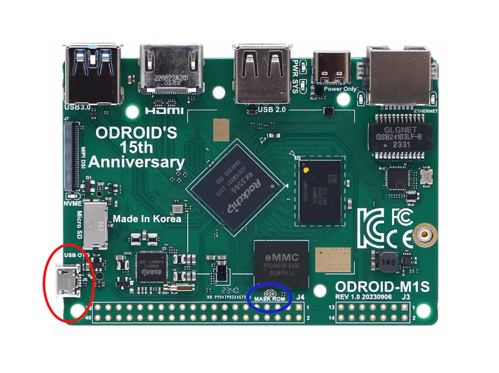
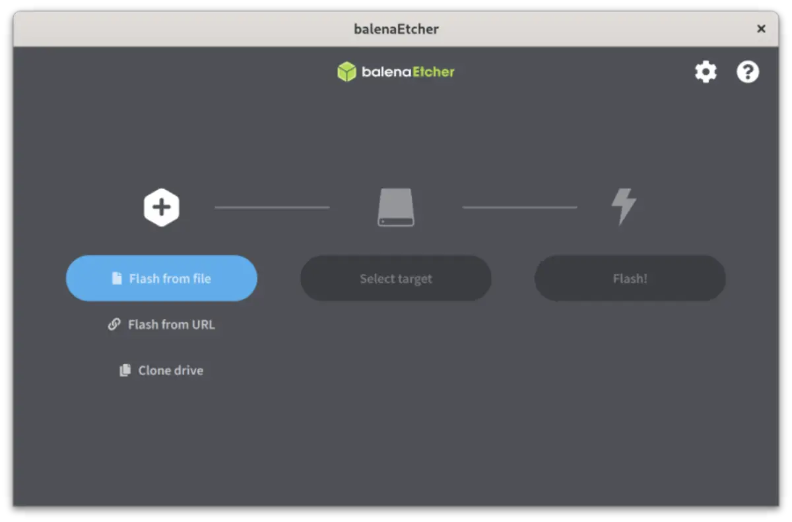

### Introduction

Introducing the Odroid M1S, a sleek and streamlined iteration of the renowned Odroid M1 by Hardkernel. This Single Board Computer (SBC) boasts impressive features, making it an ideal foundation for Home Assistant OS (HAOS). This board represents great value and even includes a case and power supply, making it significantly cheaper than the Raspberry Pi 4/5.

Our developer [Darkxst](https://github.com/darkxst) has been hard at work porting HAOS to run on the Odroid M1S. Starting with HAOS 12.0 there will be full support for this board. However you can test it right now by installing the beta images.

**Features:**

* Rockchip RK3566 Quad-core Arm Cortex-A55 processor
* 4 or 8GB LPDDR4 RAM
* 64GB eMMC (soldered)
* Pcie 2.1 NVMe M2 slot
* New 14pin GPIO header that supports a variety of addon boards

Join us as we explore the seamless installation of HAOS on this cutting-edge SBC, unlocking a world of possibilities that are provided by the amazing Home Assistant smart home platform.

### Prerequisites

* [Odroid M1S](https://shop.dialedin.com.au/products/odroid-m1s)
* balenaEtcher or similar flashing tool such as Rufus (Windows)
* Micro USB cable

### USB Mass Storage Mode

As the eMMC in the Odroid M1S is soldered to the board, its not possible to simply plug the eMMC into your computer like on previous versions of Odroid boards. As such Hardkernel have release a special tool to make the Odroid M1S show up as USB mass storage device on your computer.

1. Download [SD Image](https://dn.odroid.com/RK3566/ODROID-M1S/Installer/ODROID-M1S_EMMC2UMS.img)
2. Flash to an SD Card using balenaEtcher
3. Put into SD slot on Odroid M1S and power it up
4. Plug a Micro USB cable into the `USB OTG` port on the Odroid.
5. The Odroid eMMC will show up as a removable device on your Computer.



Installing HAOS erases Petitboot, the factory bootloader provided by Hardkernel. If you wish to return to using official Hardkernel images, short the two maskrom pads near the 40pin connector while booting an SD card with [Recovery Image][1]

### Flash Home Assistant OS

Now that you have your Odroid M1S connected as USB drive, installing HAOS is as simple as flashing the drive using balena Etcher.

Until the official documentation is updated, you can find the latest images on the [Release Page][2].

1. Open balenaEtcher and select `Flash from URL`
2. Enter the URL, at the time of writing this was the most recent release: 
```
https://github.com/home-assistant/operating-system/releases/download/12.0.rc1/haos_odroid-m1s-12.0.rc1.img.xz
```
3. Click `Select Target` and select the USB Mass Storage Device that matches your Odroid M1S
4. Finally click `Flash` and within a few minutes HAOS will be installed on your device
5. Remove SD Card and reboot your Odroid M1S

Home Assistant will boot up and you are now ready to complete onboarding or restore a previous backup. The official Home Assistant website has a detailed [Onboarding guide][4] you can follow.




### Addon Boards
Odroid-M1S introduces a new 14pin expansion header for use with addon boards. There is a range of addon boards available, however at this point not all functionality is supported by the upstream kernel used by Home Assistant OS.

Currently supported modules include:

* UPS
* Internal USB
* Mini IO board (partial support)

### Links

* You can file any bug reports on the official [Issues Page](https://github.com/home-assistant/operating-system/issues).
* [Odroid Wiki](https://wiki.odroid.com/odroid-m1s/odroid-m1s)
* [HAOS docs][5]


[1]: https://wiki.odroid.com/odroid-m1s/getting_started/os_installation_guide
[2]: https://github.com/home-assistant/operating-system/tags
[3]: https://github.com/home-assistant/operating-system/releases/download/12.0.rc1/haos_odroid-m1s-12.0.rc1.img.xz
[4]: https://www.home-assistant.io/getting-started/onboarding/
[5]: https://github.com/home-assistant/operating-system/blob/dev/Documentation/boards/hardkernel/odroid-m1s.md